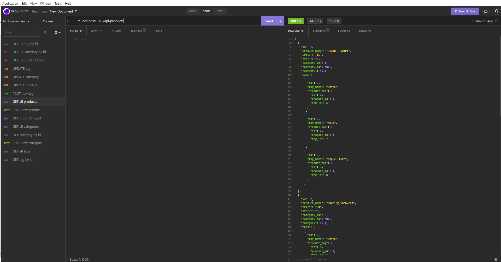

# E-Commerce Back End

## Description

It is a back-end application for an e-commerce platform. It uses a MySQL databease to track products. It operates with three tables namely products, categories, and tags. Users can add new rows to any of the tables update them or delete them. Update and delete methods require the id of the row. A single row can be filtered out of the table using the id. 

## Installation

`npm install`
`npm run start`

## Usage

[Google drive video link](https://drive.google.com/file/d/1aNm5cMPzqL2rE3LCrkUH3_02cOjwlMIg/view?usp=sharing)

## Credits

Starter code cloned from https://github.com/coding-boot-camp/fantastic-umbrella
